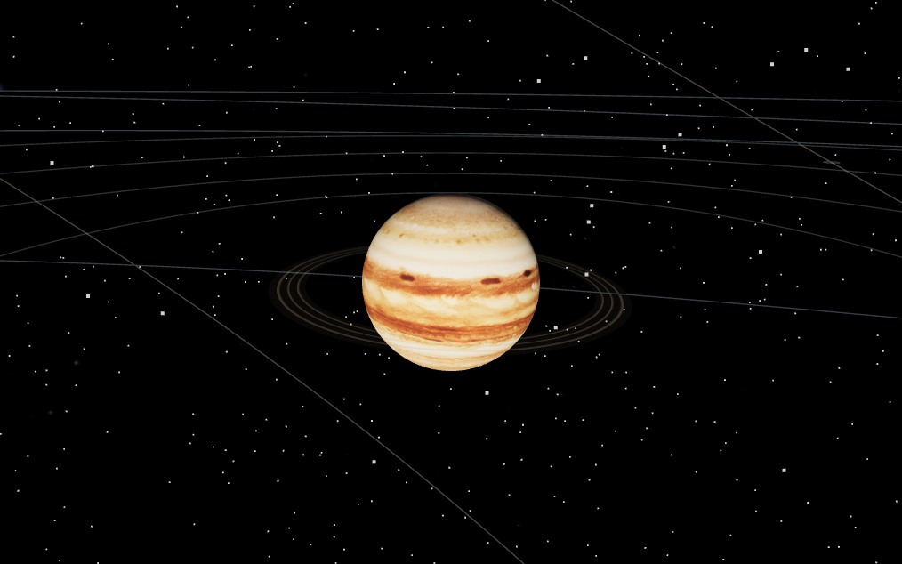
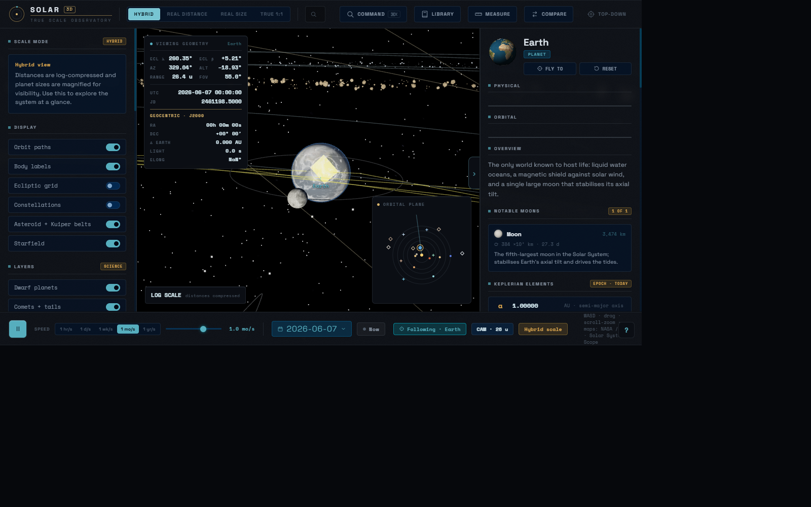
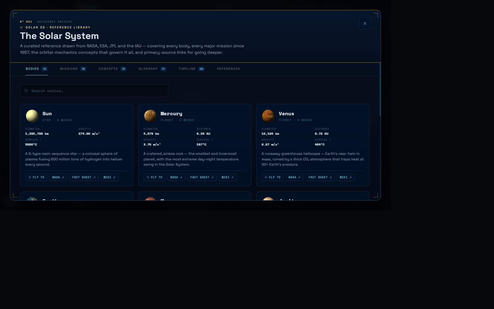
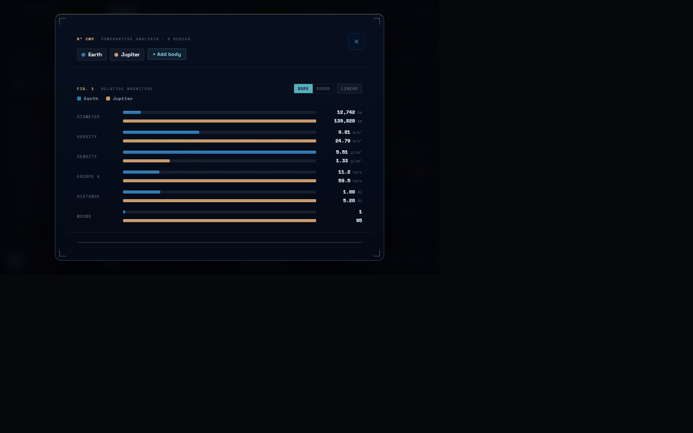
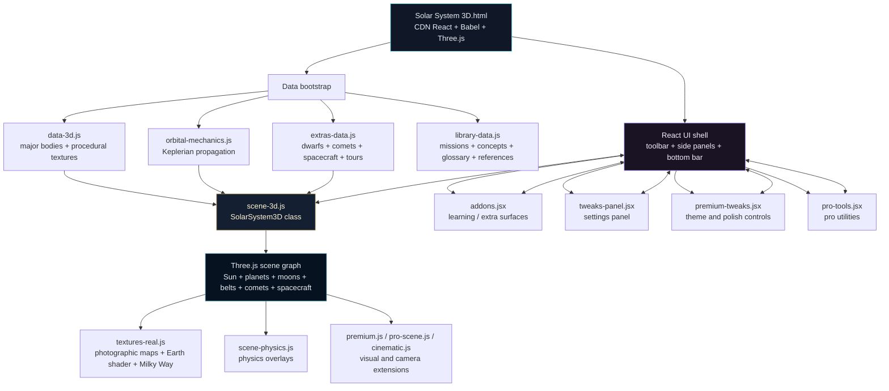
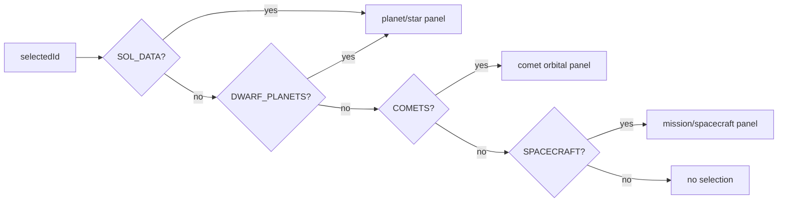
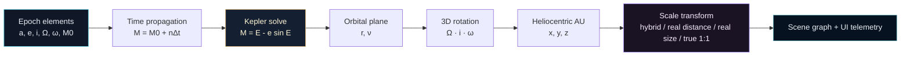
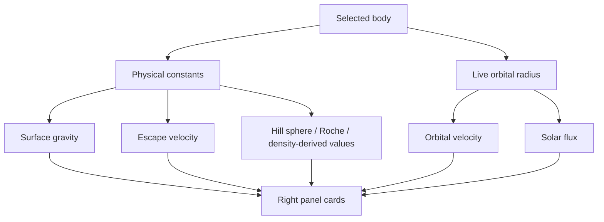
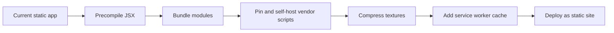

<!-- markdownlint-disable MD033 MD041 MD034 MD013 -->

<div align="center">

<br/>

<p>
  <a href="https://react.dev"></a>
  <a href="https://threejs.org"></a>
  <a href="https://www.khronos.org/webgl/"></a>
  
</p>

<p>
  
  
  
  
  
</p>

<br/>

<h1 align="center">S O L A R &nbsp;&nbsp; 3 D</h1>

<h3 align="center">True Scale Observatory</h3>

<p>
  <sub>
    Real-time WebGL Solar System simulator &nbsp;&middot;&nbsp;
    physically meaningful scale modes &nbsp;&middot;&nbsp;
    Keplerian ephemerides<br/>
    live telemetry &nbsp;&middot;&nbsp;
    science overlays &nbsp;&middot;&nbsp;
    cinematic tours &nbsp;&middot;&nbsp;
    no build system
  </sub>
</p>

<br/>

<p>
  
</p>

<p>
  <sub>
    Static WebGL observatory with live orbital propagation, local texture assets, and scientific UI overlays.
  </sub>
</p>

</div>

---

## Launch

| Path | Command | Best For |
| --- | --- | --- |
| **Recommended local server** | `python -m http.server 5173 --bind 127.0.0.1` | Stable texture loading, CDN scripts, hash deep-links |
| **Node alternative** | `npx serve . -l 5173` | Teams already using Node tooling |
| **Direct file preview** | Open `index.html` | Quick inspection only; local server is safer for assets |

Open the app after starting the local server:

```text
http://127.0.0.1:5173/
```

No installation step is required. The project is a static browser application: React, ReactDOM, Babel Standalone, Three.js, and OrbitControls are loaded from pinned CDN URLs in the HTML app entry point; all project data, renderer code, UI modules, and texture assets are local files. `index.html` exists so GitHub Pages and other static hosts can open the project from the repository root; it forwards to `Solar System 3D.html` while preserving query strings and share hashes.

### GitHub Pages

This repository can be published directly from the root folder:

1. Push the repository to GitHub.
2. Open **Settings → Pages**.
3. Set **Source** to **Deploy from a branch**.
4. Select the default branch and the repository root (`/`).
5. Open the Pages URL after deployment finishes.

The included `.nojekyll` file keeps GitHub Pages in plain static-file mode.

<div align="center">

<table>
<tr><th>Runtime Signal</th><th>Value</th></tr>
<tr><td>Entry point</td><td><code>index.html</code> forwarding to <code>Solar System 3D.html</code></td></tr>
<tr><td>Build system</td><td>None</td></tr>
<tr><td>Application model</td><td>Static HTML + global module scripts + Babel JSX islands</td></tr>
<tr><td>Renderer</td><td>Three.js WebGL scene with custom extensions</td></tr>
<tr><td>Primary assets</td><td>Local NASA / Solar System Scope inspired texture maps</td></tr>
<tr><td>Persistence</td><td>Browser <code>localStorage</code> for onboarding, saved views, recents, tweaks</td></tr>
</table>

</div>

---

## Overview

**Solar 3D** is a browser-native Solar System observatory that combines a real-time **Three.js 3D scene**, physically grounded **Keplerian orbital propagation**, photographic planet texture upgrades, and a dense React-powered control surface. It is not a marketing landing page or a simple decorative orbit demo; it is an interactive tool for exploring scale, position, light-time, orbital elements, spacecraft trajectories, planetary physics, and curated reference material.

The project deliberately keeps a low-friction runtime: one HTML entry point, no bundler, no package install, no backend, no database. The application loads structured data files first, then the renderer, then enhancement layers, and finally React / JSX UI surfaces mounted into separate roots. That makes the code easy to run locally while still supporting advanced features such as telemetry HUDs, command palette actions, multi-body comparison charts, guided tours, shareable hash links, and cinematic presentation modes.

> **Core design principle:** show the Solar System honestly when possible, compress or magnify only when necessary, and always label what the current scale model is doing.

---

## Observatory Gallery

<table>
<tr>
<td width="50%">

<br/><sub><b>Observatory Dashboard</b> — Earth-centered telemetry, hybrid scale controls, local texture rendering, and selected-body science cards.</sub>
</td>
<td width="50%">

<br/><sub><b>Reference Library</b> — NASA / ESA / JPL / IAU-oriented body catalogue, mission references, glossary, timeline, and source links.</sub>
</td>
</tr>
<tr>
<td width="50%">

<br/><sub><b>Comparative Analysis</b> — normalized bars and metric table for diameter, gravity, density, escape velocity, orbital distance, and moons.</sub>
</td>
<td width="50%">

<br/><sub><b>Cinematic Frame</b> — clean WebGL capture for presentation, export, and science communication.</sub>
</td>
</tr>
</table>

---

## Feature Matrix

| Area | Capability | Implementation |
| --- | --- | --- |
| **Scale modes** | Hybrid, real distance, real size, true 1:1 | UI state drives renderer scale transforms and planet magnification |
| **Orbital motion** | Planets, dwarf planets, comets, spacecraft | Keplerian elements plus mission-specific propagation helpers |
| **Photoreal textures** | Sun, planets, Moon, Pluto, Earth clouds, Milky Way | `textures-real.js` swaps procedural fallbacks for local maps |
| **Earth shader** | Day/night terminator, city lights, ocean specular | Custom GLSL shader material fed by live Sun direction |
| **Science overlays** | velocity, area sweep, Hill sphere, Lagrange points, barycentre | `scene-physics.js` attaches selectable physics visualization layers |
| **Telemetry HUD** | ecliptic coordinates, az/alt, range, FOV, UTC, Julian Date | live camera, clock, and selected-body calculations in React |
| **Observation panel** | Earth-relative distance, light delay, elongation, magnitude, phase | runtime astrometry approximations from heliocentric positions |
| **Library** | bodies, missions, concepts, glossary, references, timeline | structured content in `library-data.js` rendered in modal tabs |
| **Tours** | Grand Tour, inner planets, gas giants, ice giants, tidal locking, ocean worlds | sequenced narration + camera fly-to states from `extras-data.js` |
| **Command palette** | navigate, switch mode, toggle layers, save views, export JSON | localStorage-backed command system inside main React app |
| **Share/export** | deep link, postcard PNG, clean frame export, photo mode | hash state + canvas capture helpers |
| **Responsive controls** | desktop panels, mobile floating actions, bottom sheets | CSS media queries plus app state classes |

---

## Architecture



---

## Rendering Pipeline

```mermaid
sequenceDiagram
    participant HTML as HTML Entry
    participant Data as Data Modules
    participant Scene as SolarSystem3D
    participant Texture as Real Texture Layer
    participant UI as React UI
    participant Loop as Animation Loop

    HTML->>Data: Load body catalogues, orbital elements, missions, tours
    HTML->>Scene: Construct renderer, camera, lights, raycaster, controls
    Scene->>Scene: Build planets, moon systems, orbit paths, belts, labels
    Scene->>Texture: Upgrade procedural surfaces to photographic maps
    Texture->>Texture: Attach Earth shader, cloud shell, Milky Way sphere
    HTML->>UI: Mount toolbar, panels, library, command palette, bottom bar
    UI->>Scene: Dispatch mode, layer, time, selected body, camera actions
    Loop->>Scene: Update orbital positions and spacecraft propagation
    Loop->>Texture: Update Earth terminator and clouds
    Loop->>UI: Publish camera distance, selected object, sim date, telemetry
```

The scene starts with procedural canvas textures so the app can render quickly even while large image maps are loading. Once real maps are available, `textures-real.js` upgrades materials in place without replacing the scene graph. Earth receives a custom shader because it needs day/night blending, night-side lights, and specular ocean response rather than a single static diffuse map.

---

## Project Map

```text
./
  index.html                 # static-host entry, forwards to the app page
  Solar System 3D.html       # HTML app, CSS, root React app, toolbar/panels/modals
  data-3d.js                 # major body catalogue + procedural texture generators
  orbital-mechanics.js       # planetary and comet propagation helpers
  extras-data.js             # dwarf planets, comets, spacecraft, events, tours
  library-data.js            # reference library: missions, concepts, glossary, links
  scene-3d.js                # core Three.js renderer and scene graph
  textures-real.js           # real texture upgrade layer + Earth shader + Milky Way
  physics.js                 # formulas and per-body physics cards
  scene-physics.js           # visual physics overlays attached to the 3D scene
  premium.js                 # visual polish helpers
  pro-scene.js               # professional scene/camera extensions
  cinematic.js               # cinematic camera and presentation behavior
  icons.js                   # shared monoline icon path registry
  addons.jsx                 # extra React features and learning surfaces
  tweaks-panel.jsx           # runtime settings and adjustment panel
  premium-tweaks.jsx         # theme and premium UI controls
  pro-tools.jsx              # pro tools, reports, print/export helpers
  textures/                  # local maps used by the real texture layer
```

The workspace was cleaned so obsolete 2D app files, standalone bundle output, unused ring/starfield texture leftovers, and screenshot artefacts are no longer part of the active project.

---

## Data Model

| File | Owns | Notes |
| --- | --- | --- |
| `data-3d.js` | Sun, planets, Pluto-style core catalogue, notable moons, physical facts | Exposes `window.SOL_DATA`, procedural texture helpers, distance/time formatters |
| `extras-data.js` | dwarf planets, comets, spacecraft, nearby stars, dated events, tours | Exposes `window.DWARF_PLANETS`, `window.COMETS`, `window.SPACECRAFT`, `window.TOURS` |
| `orbital-mechanics.js` | secular orbital elements and propagation functions | Provides heliocentric AU positions for planets and comet-like bodies |
| `library-data.js` | missions, concepts, glossary, timeline, references | Feeds the in-app research library modal |
| `physics.js` | formula output and computed physics cards | Produces values such as gravity, escape velocity, light-time, orbital dynamics |
| `textures-real.js` | texture manifest and material upgrade pipeline | Exposes `window.REAL_TEX` for thumbnails and scene material swaps |

### Body Lookup Strategy



This lookup pattern appears across the right panel, command palette, minimap, measurement HUD, compare modal, and export helpers. When adding a new object type, keep the lookup chain coherent across those surfaces.

---

## Scale System

| Mode | What It Preserves | What It Sacrifices | Intended Use |
| --- | --- | --- | --- |
| **Hybrid** | recognisable overview and navigability | true linear distances | default exploration |
| **Real Distance** | orbit spacing | body visibility | understanding emptiness and outer-system scale |
| **Real Size** | body diameter ratios | orbit spacing | comparing planet/star sizes |
| **True 1:1** | size and distance simultaneously | visual discoverability | honest scale demonstration with locator dots |

The app also exposes a magnification slider. Magnification is not hidden: the left panel states when bodies are enlarged beyond their true relative size, and the scale disclaimer updates when modes change.

---

## Controls

| Input | Action |
| --- | --- |
| Left drag | rotate around target |
| Right drag / middle drag | pan camera |
| Mouse wheel | zoom |
| Click body | select and follow body |
| `W` `A` `S` `D` | free-flight movement |
| `Q` / `E` | down / up movement |
| `Shift` | boost free-flight speed |
| Arrow keys | alternate movement |
| `Ctrl+K` / `Cmd+K` | command palette |
| `/` | command palette shortcut |
| `1`-`8` | jump to Mercury through Neptune |
| `9` | jump to Sun |
| `0` | jump to Pluto |
| `Esc` | close overlays, exit photo/measure/tour modes |

---

## Scientific Modules

Solar 3D is designed as an inspectable scientific visualization, not a black-box animation. The renderer separates three concerns: **ephemeris state** (where a body is), **physical state** (what the body is), and **observational state** (what the camera or an Earth-based observer would measure). The UI surfaces the same quantities as readable telemetry, body cards, overlays, and comparison charts.

### Mathematical Formulation

The project uses simplified two-body / patched educational models where they are appropriate for browser-scale visualization. Symbols follow standard celestial-mechanics convention: `a` semi-major axis, `e` eccentricity, `i` inclination, `Ω` longitude of ascending node, `ω` argument of periapsis, `ν` true anomaly, `E` eccentric anomaly, `M` mean anomaly, `μ = G(M + m)` gravitational parameter, `r` heliocentric radius, and `Δ` observer-target distance.

| Domain | Formula | Runtime Use |
| --- | --- | --- |
| Mean motion | $$n = \sqrt{\frac{\mu}{a^3}}$$ | Advances planetary and comet mean anomaly from epoch time |
| Kepler equation | $$M = E - e\sin E$$ | Solves elliptical orbital position from mean anomaly |
| True anomaly | $$\nu = 2\tan^{-1}\left(\sqrt{\frac{1+e}{1-e}}\tan\frac{E}{2}\right)$$ | Converts orbital-plane position to heliocentric scene coordinates |
| Orbital radius | $$r = a(1 - e\cos E) = \frac{a(1-e^2)}{1 + e\cos\nu}$$ | Drives orbit paths, selected-body telemetry, and scale-bar context |
| Vis-viva speed | $$v = \sqrt{\mu\left(\frac{2}{r} - \frac{1}{a}\right)}$$ | Computes orbital velocity cards and velocity-vector overlays |
| Surface gravity | $$g = \frac{GM}{R^2}$$ | Body physics card and comparative analysis metrics |
| Escape velocity | $$v_{esc} = \sqrt{\frac{2GM}{R}}$$ | Body physics card and normalized compare panel |
| Hill sphere | $$r_H \approx a(1-e)\sqrt[3]{\frac{m}{3M_\odot}}$$ | Selected-body gravitational-domain overlay |
| Barycentre offset | $$r_b = a\frac{m}{M_\odot + m}$$ | Sun-planet barycentre marker for large-planet systems |
| Solar irradiance | $$S(r) = S_\oplus\left(\frac{1\,AU}{r}\right)^2$$ | Solar flux and equilibrium-temperature estimates |
| Equilibrium temperature | $$T_{eq}=\left(\frac{S(1-A)}{4\epsilon\sigma}\right)^{1/4}$$ | Climate/energy balance card with albedo and emissivity assumptions |
| Light-time | $$t_L = \frac{\Delta}{c}$$ | Observation panel delay in minutes or seconds |
| Elongation | $$\cos\epsilon = \frac{\vec r_{target}\cdot\vec r_{sun}}{\lVert\vec r_{target}\rVert\,\lVert\vec r_{sun}\rVert}$$ | Earth-relative observing geometry |
| Apparent magnitude | $$m \approx H + 5\log_{10}(r\Delta) + \Phi(\alpha)$$ | Approximate brightness display for educational comparison |

The formulation is intentionally transparent: values are visible in UI cards, formulas are grouped in code by responsibility, and the README documents the approximation tier. For mission-grade astrometry, occultation prediction, spacecraft navigation, or telescope scheduling, use authoritative numerical ephemerides such as JPL Horizons.

### Coordinate And Scale Pipeline



### Fidelity Contract

| Layer | What It Is Good For | Deliberate Limit |
| --- | --- | --- |
| Keplerian propagation | Educational orbital geometry, relative motion, scale reasoning | Does not model full N-body perturbations or relativistic correction |
| Spacecraft paths | Mission context and approximate trajectory storytelling | Not suitable for navigation-grade state vectors |
| Visual scale modes | Honest demonstrations of distance/diameter tradeoffs | Hybrid mode intentionally compresses distance and magnifies bodies |
| Photographic textures | Recognizable planetary surfaces and presentation quality | Texture lighting is illustrative, not a remote-sensing pipeline |
| Observation panel | Light-time, elongation, phase, and approximate magnitude intuition | Apparent magnitude and phase functions are simplified |

### Live Astrometry

The telemetry and observation panels compute live values from camera state, simulation time, and heliocentric coordinates:

```text
Ecliptic longitude / latitude
View azimuth / altitude
Camera range and field of view
UTC and Julian Date
Geocentric RA / Dec for selected bodies
Earth-relative distance and light delay
Solar elongation and illuminated phase
Approximate apparent magnitude
```

### Physics Cards

The selected-body panel surfaces computed quantities with formulas and units. The intent is to make the numbers inspectable rather than decorative.



### Physics Overlays

The scene can draw selected-body overlays for:

| Overlay | Purpose |
| --- | --- |
| Velocity vector | orbital motion direction and relative magnitude |
| Radius + area sweep | Kepler's second law visualization |
| Hill sphere | local gravitational dominance region |
| Lagrange points | L1 through L5 in the Sun-body frame |
| Barycentre | Sun-planet center-of-mass marker |

---

## Interface Surfaces

| Surface | Role |
| --- | --- |
| **Toolbar** | mode switcher, search, command palette, library, measure, compare, photo, share, tours |
| **Left panel** | scale mode explanation, display toggles, science layers, physics overlays, body list |
| **Middle area** | telemetry, minimap, scale bar, labels, event banner, measurement HUD, tour narration |
| **Right panel** | selected body profile, physical data, orbital data, observations, moons, facts, physics |
| **Bottom bar** | play/pause, speed presets, date picker, live-now mode, camera distance, current scale |
| **Library modal** | bodies, missions, concepts, glossary, timeline, references |
| **Command palette** | keyboard-first navigation and power actions |
| **Compare modal** | multi-body normalized bars, radar chart, metric table |

---

## Deep Links And Sharing

Solar 3D stores the current view in the URL hash so a view can be copied and restored.

```text
#m=hybrid&b=earth&x=5
```

| Hash Key | Meaning | Example |
| --- | --- | --- |
| `m` | scale mode | `hybrid`, `real_distance`, `real_size`, `true_scale` |
| `b` | selected body id | `earth`, `jupiter`, `halley`, `voyager1` |
| `x` | planet magnification | `5`, `12.5` |
| `d` | date, when provided by share helpers | `2026-06-04` |

The Share menu can copy a link to the current view or export a postcard PNG with a caption. Photo mode hides interface chrome so screenshots focus on the scene.

---

## Runtime State

Solar 3D uses `localStorage` for lightweight browser persistence. Clearing site data resets these preferences.

| Key | Purpose |
| --- | --- |
| `solar_seen_intro` | first-run onboarding dismissal |
| `solar_cmdk_recents` | command palette recent destinations |
| `solar_saved_views` | saved camera/body/mode/date views |
| `solar_quiz` | add-on quiz progress/statistics |
| `tweaks:premium-tweaks` | theme and visual tweak state |

No account, backend, cookie banner, database, or external persistence layer is used.

---

## Development Workflows

### Add A Planet Or Core Body

1. Add a `SOL_DATA` entry in `data-3d.js` with physical properties, display color, facts, and notable moons.
2. Add or extend orbital elements in `orbital-mechanics.js` if the body needs propagated positions.
3. Add texture metadata in `textures-real.js` only if a local real map exists.
4. Add body-specific reference links in `library-data.js` when authoritative sources are available.
5. Test selection, right-panel data, minimap visibility, command palette lookup, compare modal, and share hash behavior.

### Add A Dwarf Planet, Comet, Or Spacecraft

1. Use `extras-data.js` rather than `data-3d.js`.
2. Dwarf planets should mirror the `SOL_DATA` shape where possible.
3. Comets use orbital elements with perihelion epoch and eccentricity.
4. Spacecraft can use fixed reference position + AU/day velocity, a body-following offset, or Keplerian elements.
5. Confirm the object appears in scene creation, right-panel lookup, command palette, and measurement mode.

### Add A Guided Tour

Add a new object to `window.TOURS` in `extras-data.js`:

```js
{
  id: 'example-tour',
  name: 'Example Tour',
  description: 'Short description shown in the tours popover.',
  steps: [
    { bodyId: 'earth', narration: 'Narration shown while the camera flies to Earth.' },
    { bodyId: 'mars', narration: 'Narration shown while the camera flies to Mars.' },
  ],
}
```

### Add A Texture

1. Place the image in `textures/`.
2. Register it in `REAL_TEX` inside `textures-real.js`.
3. Use `map`, `bump`, `spec`, `night`, or `clouds` depending on material needs.
4. Run the dependency audit below so missing file references fail early.

---

## Dependency Audit

Run this from the workspace root to verify that every local script referenced by the HTML entry point and every texture referenced by `textures-real.js` exists on disk:

```powershell
$root = "."
$html = Get-Content (Join-Path $root "Solar System 3D.html") -Raw
$scriptRefs = [regex]::Matches($html, '<script[^>]+src="([^"]+)"') |
  ForEach-Object { $_.Groups[1].Value } |
  Where-Object { $_ -notmatch '^https?://' } |
  ForEach-Object { ($_ -split '\?')[0] }
$textureRefs = [regex]::Matches((Get-Content "$root\textures-real.js" -Raw), "'([^']+\.(?:jpg|png|gif))'") |
  ForEach-Object { 'textures\' + $_.Groups[1].Value }
$missing = @($scriptRefs + $textureRefs | Where-Object { -not (Test-Path (Join-Path $root $_)) })
if ($missing.Count) { 'MISSING:'; $missing } else { "OK: $($scriptRefs.Count) local scripts and $($textureRefs.Count) texture references exist." }
```

Expected result for the current cleaned project:

```text
OK: 17 local scripts and 21 texture references exist.
```

---

## Troubleshooting

| Symptom | Likely Cause | Fix |
| --- | --- | --- |
| Blank page or only splash visible | CDN script did not load or the browser blocked WebGL | Check internet access for CDN dependencies; confirm WebGL is enabled |
| Textures are missing | Running from the wrong directory or stale local server root | Start the server from the repository root and open `/` |
| Port 8000 is busy | Another local server is already running | Use another port, for example `python -m http.server 8010 --bind 127.0.0.1` |
| Hash opens the wrong body | Old shared URL state | Remove the hash after `.html` or use Reset in the toolbar |
| Movement feels too fast or too slow | Free-flight speed scales with distance | Move closer/farther or reset camera target |
| Browser warns about Babel | JSX is compiled in-browser by design | Acceptable for local/static runtime; precompile only if packaging for production |
| Some values look approximate | Ephemerides are simplified secular/orbital models | Use NASA/JPL Horizons for mission-grade navigation |

---

## Performance Notes

Solar 3D is intentionally static, but it is still GPU-heavy. The scene contains textured spheres, orbit paths, labels, particles, transparent overlays, physics helpers, and several React panels updating from live simulation state.

Recommended environment:

| Component | Recommendation |
| --- | --- |
| Browser | Current Chrome, Edge, Firefox, or Safari with WebGL enabled |
| GPU | Integrated GPU works; discrete GPU improves high-DPI and large displays |
| Display | 1080p or higher recommended for telemetry-heavy layouts |
| Server | Local HTTP server for stable image loading |

Performance-sensitive toggles:

| Toggle | Impact |
| --- | --- |
| Starfield / Milky Way | large sky sphere + texture |
| Labels | per-frame screen-space projection |
| Comets + tails | extra orbit paths and sprite updates |
| Physics overlays | extra geometry around selected body |
| Photo/postcard export | canvas readback and PNG encode |

---

## Source Credibility

The in-app reference layer is curated from public NASA, ESA, JPL, IAU, and educational astronomy sources. The simulation itself is an educational visualization, not a navigation system.

| Domain | Source Class |
| --- | --- |
| physical constants | NASA planetary fact sheets and public mission references |
| orbital mechanics | Keplerian/secular element approximations, JPL-style conventions |
| missions | NASA / ESA / JAXA public mission portals |
| concepts | astronomy textbooks, IAU definitions, NASA educational material |
| imagery | local texture maps derived from public-domain / openly mirrored planetary texture sets |

Scientific humility clause: values are intended for high-quality education and visual reasoning. For spacecraft operations, occultation predictions, or observatory scheduling, use authoritative ephemeris services such as JPL Horizons.

---

## Production Packaging Ideas

The current project is optimized for direct local execution. If it later needs to ship as a polished public site, these are the natural next steps:



Recommended improvements for a production pass:

| Area | Upgrade |
| --- | --- |
| Build | Vite or esbuild for precompiled React/JSX |
| Assets | WebP/AVIF texture variants and cache headers |
| Reliability | self-host React, Babel replacement, Three.js, OrbitControls |
| QA | Playwright smoke tests for canvas render and key UI actions |
| Accessibility | formal keyboard focus pass for all toolbar/menu controls |
| Documentation | screenshots or short GIFs after the visual state stabilizes |

---

## Verification Checklist

Before considering a change complete:

```text
[ ] Start local server from the repository root
[ ] Open /
[ ] Confirm canvas renders and toolbar is interactive
[ ] Select Sun, Earth, Jupiter, Pluto, a comet, and a spacecraft
[ ] Toggle scale modes and magnification
[ ] Open Library, Measure, Compare, Share, Tours, and Command palette
[ ] Run dependency audit
[ ] Check browser console for 404s or runtime exceptions
```

---

## License

No explicit license file is currently included in this workspace. Treat the code and local assets as private unless a license is added by the project owner.

---

<div align="center">

<sub>
Built as a browser-native observatory: one HTML entry, local scientific data, GPU-rendered space, and enough controls to get beautifully lost without leaving the machine.
</sub>

</div>
