<!-- markdownlint-disable MD033 MD041 MD034 MD013 -->

<div align="center">

<p>
  <a href="https://react.dev"></a>
  <a href="https://threejs.org"></a>
  <a href="https://www.khronos.org/webgl/"></a>
  <a href="LICENSE"></a>
  
</p>

<p>
  
  
  
  
  
</p>

<br/>

<h1 align="center">S O L A R &nbsp;&nbsp; 3 D</h1>

<h3 align="center">True Scale Observatory</h3>

<p>
  <sub>
    Browser-native Solar System observatory &nbsp;&middot;&nbsp;
    real-time WebGL scene graph &nbsp;&middot;&nbsp;
    Keplerian orbital propagation<br/>
    live astrometry &nbsp;&middot;&nbsp;
    physics overlays &nbsp;&middot;&nbsp;
    reference library &nbsp;&middot;&nbsp;
    guided tours &nbsp;&middot;&nbsp;
    no build system
  </sub>
</p>

<br/>

<p>
  
</p>

<p>
  <sub>
    Live WebGL capture from the application: Earth selection, astrometric telemetry, orbital guides, local texture rendering, and observatory controls in one frame.
  </sub>
</p>

</div>

---

## Launch

Run from the repository root:

| Path | Command | Best For |
| --- | --- | --- |
| Recommended local server | `python -m http.server 5173 --bind 127.0.0.1 --directory .` | Stable texture loading, CDN scripts, hash deep-links |
| Node alternative | `npx serve . -l 5173` | Teams already using Node tooling |
| Direct file preview | Open `index.html` | Quick inspection only; local HTTP is safer for assets |

Open the application after starting the server:

```text
http://127.0.0.1:5173/
```

No package installation is required. React, ReactDOM, Babel Standalone, Three.js, and OrbitControls are loaded from pinned CDN URLs; all application data, renderer modules, UI modules, and planetary texture assets are local files. `index.html` forwards to `Solar System 3D.html`, so static hosts can serve the repository root while preserving query strings and share hashes.

### GitHub Pages

This repository can be published directly from the root folder:

1. Push the repository to GitHub.
2. Open **Settings -> Pages**.
3. Set **Source** to **Deploy from a branch**.
4. Select the default branch and the repository root (`/`).
5. Open the Pages URL after deployment finishes.

The included `.nojekyll` file keeps GitHub Pages in plain static-file mode.

<div align="center">

<table>
<tr><th>Runtime Signal</th><th>Value</th></tr>
<tr><td>Entry point</td><td><code>index.html</code> forwarding to <code>Solar System 3D.html</code></td></tr>
<tr><td>Build system</td><td>None</td></tr>
<tr><td>Application model</td><td>Static HTML, global data modules, Babel JSX islands</td></tr>
<tr><td>Renderer</td><td>Three.js WebGL scene with photographic texture upgrades and custom overlays</td></tr>
<tr><td>Primary assets</td><td>Local planetary maps, Earth clouds, Earth night lights, Milky Way star texture</td></tr>
<tr><td>Persistence</td><td>Browser <code>localStorage</code> for onboarding, command recents, saved views, quiz progress, language, and visual tweaks</td></tr>
</table>

</div>

---

## Overview

**Solar 3D** is a browser-native scientific visualization environment for exploring the Solar System as an instrumented observatory rather than a decorative orbit animation. It combines a real-time **Three.js scene graph**, simplified but explicit **Keplerian ephemerides**, local photographic texture maps, live observing geometry, physics overlays, comparative analysis, guided tours, and source-oriented reference material.

The runtime is intentionally low-friction: one HTML application page, no bundler, no backend, no account system, no database, and no build step. Structured data files load first, then orbital mechanics, the scene renderer, texture upgrades, physics overlays, professional scene extensions, and React / JSX interface roots. That architecture keeps the project easy to run locally while still supporting advanced behaviors such as URL-restorable views, PNG frame export, object comparison tables, body dossiers, astronomical event jumps, surface exploration, and observation-planning panels.

> **Scientific design principle:** show scale honestly when possible, compress or magnify only when necessary for navigation, and always surface the current approximation layer in the interface.

---

## Observatory Gallery

The gallery below uses live screenshots generated from the running application. UI-heavy panels are cropped to their modal or workspace boundaries so the documentation shows the feature itself instead of empty margins.

### Core Observatory

<table>
<tr>
<td width="50%">

<br/><sub><b>Observatory Dashboard</b> - Earth-focused telemetry, hybrid scale mode, body selection, real-time minimap, and scientific control surfaces.</sub>
</td>
<td width="50%">
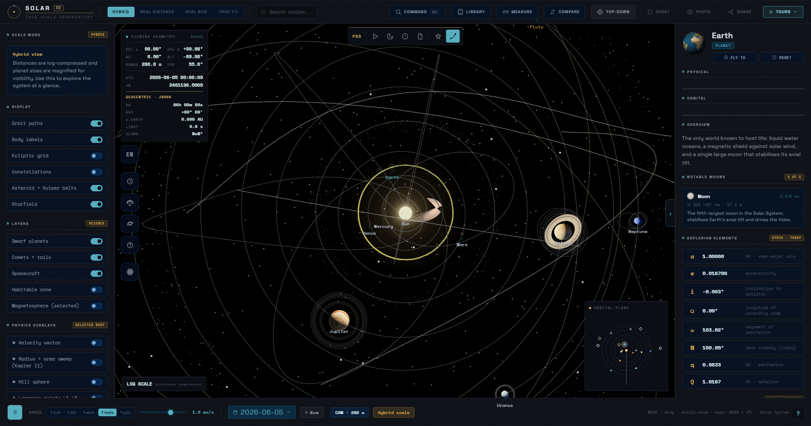
<br/><sub><b>Orbital Context</b> - top-down system view with orbit paths, asteroid and Kuiper belt particles, labels, and background starfield.</sub>
</td>
</tr>
<tr>
<td width="50%">
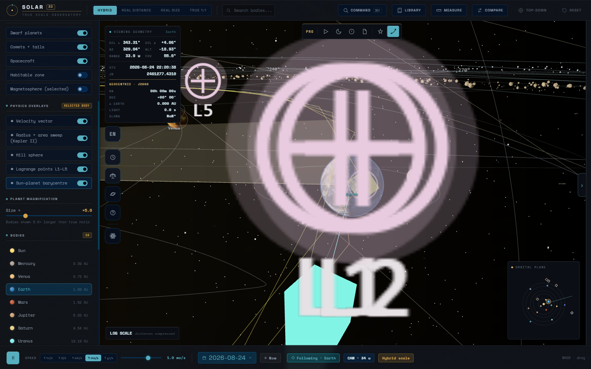
<br/><sub><b>Physics Overlays</b> - velocity vector, Kepler area sweep, Hill sphere, Lagrange points, barycentre, and ecliptic reference geometry.</sub>
</td>
<td width="50%">
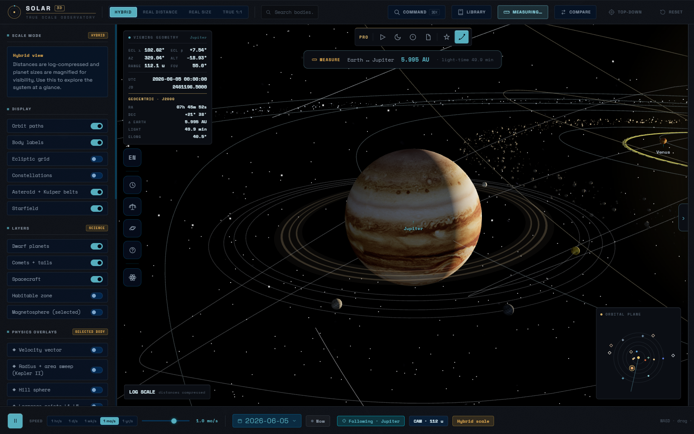
<br/><sub><b>Measurement Mode</b> - two-body distance and one-way light-time calculation shown directly in the observing workspace.</sub>
</td>
</tr>
</table>

### Research And Analysis

<table>
<tr>
<td width="50%">

<br/><sub><b>Reference Library</b> - curated body cards with diameter, gravity, temperature, source links, and direct fly-to actions.</sub>
</td>
<td width="50%">
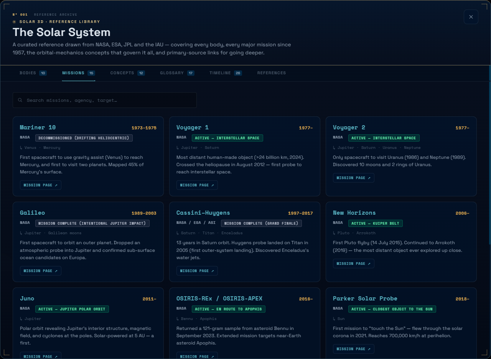
<br/><sub><b>Mission Archive</b> - NASA / ESA / JPL-oriented mission catalogue with targets, status, chronology, and external mission references.</sub>
</td>
</tr>
<tr>
<td width="50%">

<br/><sub><b>Comparative Analysis</b> - normalized bars and metric table for diameter, gravity, density, escape velocity, distance, period, rotation, tilt, and moons.</sub>
</td>
<td width="50%">
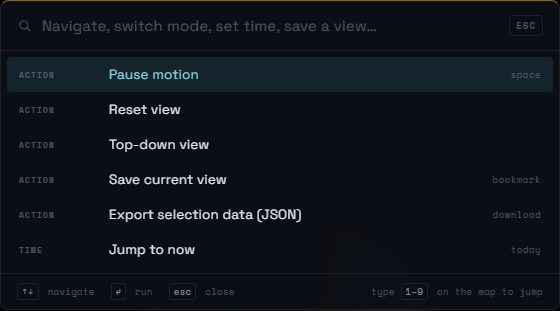
<br/><sub><b>Command Palette</b> - keyboard-first navigation, saved views, time jumps, layer toggles, JSON export, and quick actions.</sub>
</td>
</tr>
</table>

### Scientific Tools

<table>
<tr>
<td width="50%">
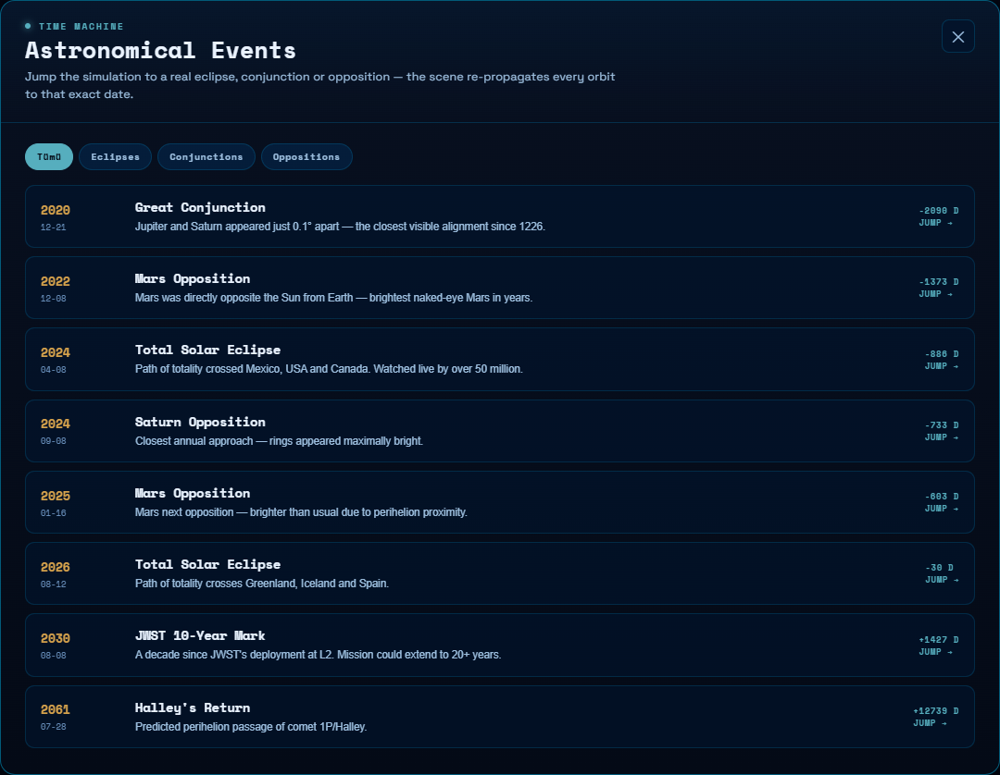
<br/><sub><b>Time Machine</b> - jump the simulation to eclipses, conjunctions, oppositions, and mission milestones.</sub>
</td>
<td width="50%">
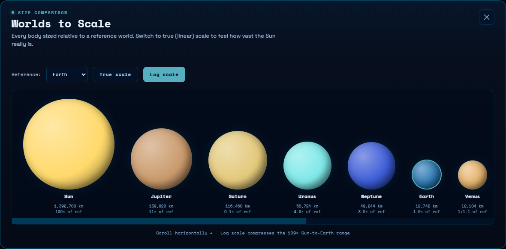
<br/><sub><b>Worlds To Scale</b> - log or true-size comparison against a selectable reference world.</sub>
</td>
</tr>
<tr>
<td width="50%">
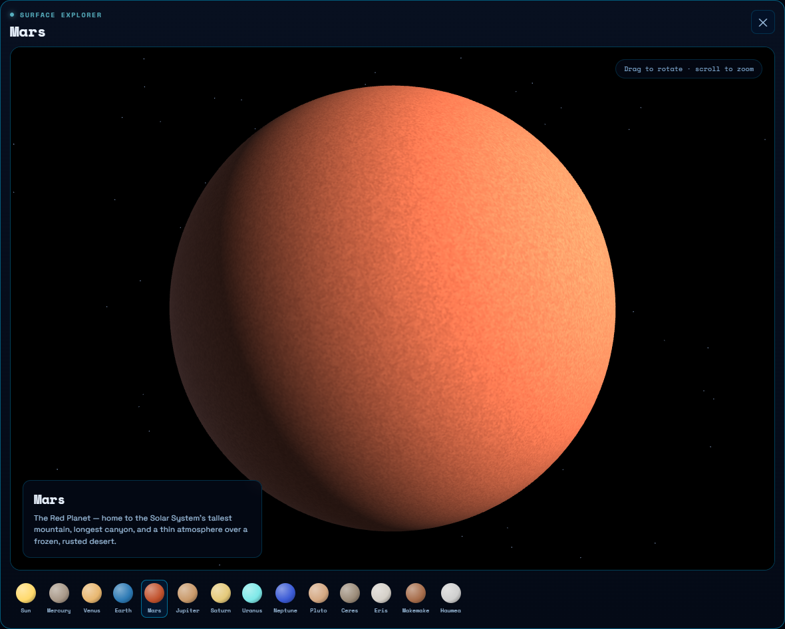
<br/><sub><b>Surface Explorer</b> - interactive mini Three.js globe for inspecting planetary surfaces and body thumbnails.</sub>
</td>
<td width="50%">
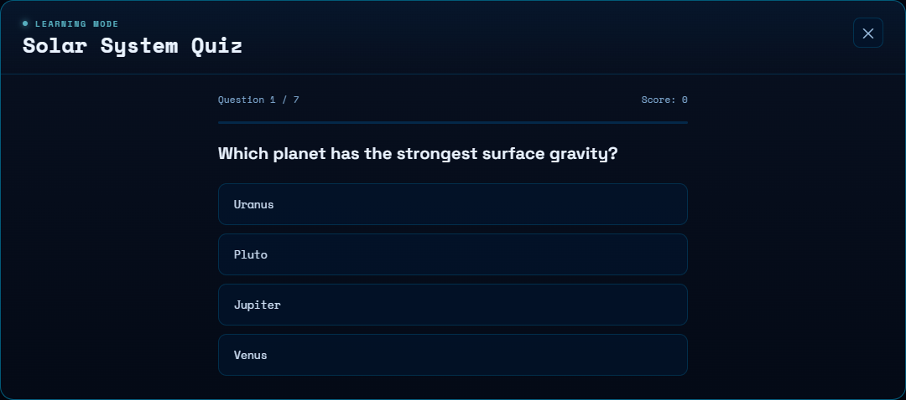
<br/><sub><b>Learning Mode</b> - quiz engine with generated questions, score, streaks, badges, and persisted learning progress.</sub>
</td>
</tr>
<tr>
<td width="50%">
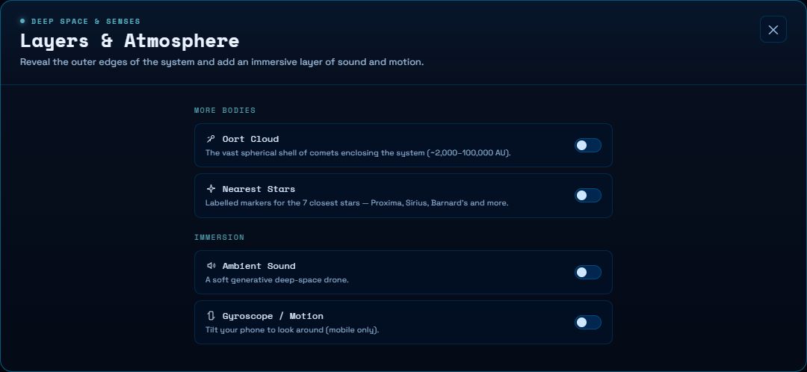
<br/><sub><b>Layers And Atmosphere</b> - Oort cloud, nearest-star markers, ambient sound, and mobile gyroscope camera interaction.</sub>
</td>
<td width="50%">
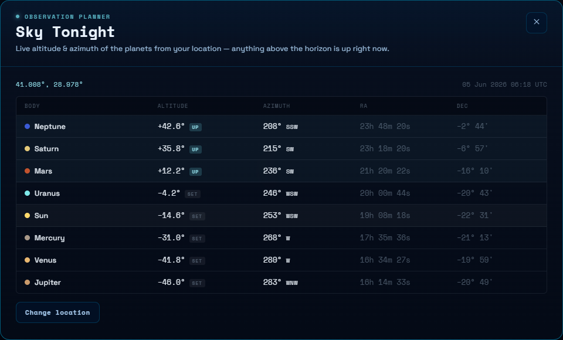
<br/><sub><b>Sky Tonight</b> - local altitude / azimuth planner with RA, Dec, horizon state, and click-to-select rows.</sub>
</td>
</tr>
<tr>
<td width="50%">
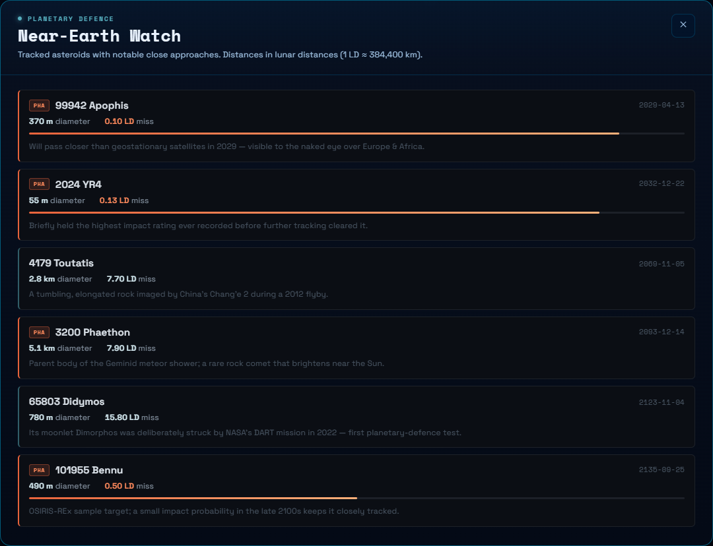
<br/><sub><b>Near-Earth Watch</b> - close-approach table for notable near-Earth objects and planetary-defense context.</sub>
</td>
<td width="50%">
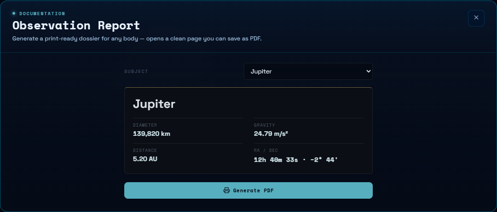
<br/><sub><b>Observation Report</b> - print-ready body dossier generator with physical data and J2000 observing coordinates.</sub>
</td>
</tr>
</table>

### Presentation Frames

<table>
<tr>
<td width="50%">

<br/><sub><b>Jupiter Cinematic Frame</b> - clean WebGL canvas capture for presentation, export, and science communication.</sub>
</td>
<td width="50%">
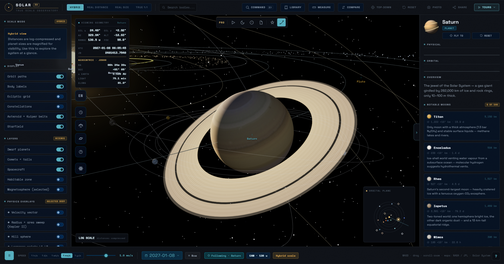
<br/><sub><b>Saturn Ring System</b> - local Saturn map, ring geometry, orbital guide paths, and starfield capture.</sub>
</td>
</tr>
<tr>
<td width="50%">
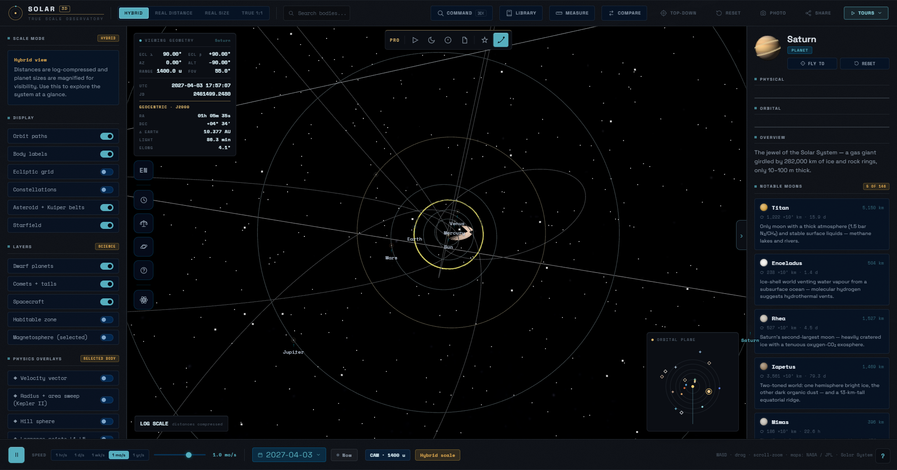
<br/><sub><b>True 1:1 Scale</b> - size and distance both real; locator dots keep sub-pixel bodies discoverable.</sub>
</td>
<td width="50%">
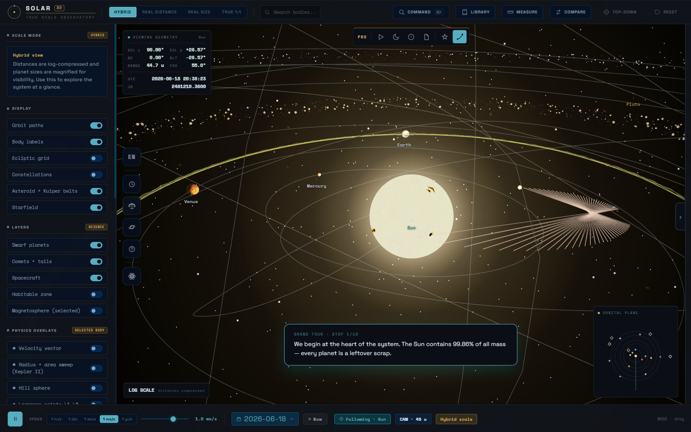
<br/><sub><b>Guided Tour</b> - narrated camera fly-to sequence with step progress and contextual science narration.</sub>
</td>
</tr>
</table>

---

## Feature Catalogue

| Domain | Capability | Implementation Surface |
| --- | --- | --- |
| Scale modes | Hybrid, real distance, real size, and true 1:1 modes | toolbar mode tabs, renderer scale transforms, scale disclaimer |
| Magnification | explicit planet-size multiplier for visibility | left panel slider, renderer radius scaling |
| Orbital propagation | planets, dwarf planets, comets, and approximate spacecraft positions | `orbital-mechanics.js`, `extras-data.js`, spacecraft helpers |
| Photographic textures | Sun, planets, Moon, Pluto, Earth clouds, city lights, Milky Way | `textures-real.js`, local `textures/` maps |
| Earth shader | day/night terminator, night-side lights, cloud shell, ocean specular response | custom material upgrade in `textures-real.js` |
| Physics overlays | velocity vector, Kepler area sweep, Hill sphere, Lagrange points, barycentre | `scene-physics.js` attached to selected body |
| Live astrometry | ecliptic coordinates, view azimuth/altitude, UTC, Julian Date, J2000 RA/Dec | `Telemetry`, `ObservationBlock`, orbital mechanics helpers |
| Observation data | Earth-relative distance, light delay, elongation, phase, approximate magnitude | right panel computed from heliocentric positions |
| Reference library | bodies, missions, concepts, glossary, timeline, source references | `library-data.js` rendered in modal tabs |
| Comparison | multi-body normalized bars, radar option, metric table | `CompareModal`, `CompareChart`, local body catalogue |
| Measurement | click two bodies to compute distance and light-time | measure mode HUD and callback interception |
| Command palette | navigation, time shifts, view modes, layers, themes, saved views, JSON export | `CommandPalette`, `localStorage` recents/views |
| Tours | grand tour, inner planets, gas giants, ice giants, tidal locking, ocean worlds | `window.TOURS`, camera fly-to sequence, narration card |
| Pro tools | Sky Tonight, NEO Watch, observation report, bright stars, probe trails | `pro-tools.jsx`, `pro-scene.js`, `pro-data.js` |
| Add-ons | TR/EN localization, event time-machine, scale compare, quiz, surface explorer, sound, gyro | `addons.jsx` independent React root |
| Share/export | URL hash restore, postcard PNG, clean frame export, selected-body JSON | share controls, photo mode, command action |
| Responsive UI | desktop panels, mobile body sheet, mobile command buttons | CSS media queries and state classes |

---

## Scientific Model

Solar 3D is an educational and analytical visualization, not a spacecraft navigation system. The model is explicit about what it preserves and where it uses approximation.

### Mathematical Formulation

The project uses two-body and patched educational models suitable for browser-scale visualization. Symbols follow standard celestial-mechanics convention: `a` semi-major axis, `e` eccentricity, `i` inclination, `Omega` longitude of ascending node, `omega` argument of periapsis, `nu` true anomaly, `E` eccentric anomaly, `M` mean anomaly, `mu = G(M + m)` gravitational parameter, `r` heliocentric radius, and `Delta` observer-target distance.

| Domain | Formula | Runtime Use |
| --- | --- | --- |
| Mean motion | $$n = \sqrt{\frac{\mu}{a^3}}$$ | advances mean anomaly from epoch time |
| Kepler equation | $$M = E - e\sin E$$ | solves elliptical orbital position |
| True anomaly | $$\nu = 2\tan^{-1}\left(\sqrt{\frac{1+e}{1-e}}\tan\frac{E}{2}\right)$$ | converts eccentric anomaly to orbital-plane angle |
| Orbital radius | $$r = a(1 - e\cos E) = \frac{a(1-e^2)}{1 + e\cos\nu}$$ | drives orbit paths, telemetry, and scale context |
| Vis-viva speed | $$v = \sqrt{\mu\left(\frac{2}{r} - \frac{1}{a}\right)}$$ | velocity cards and vector overlay |
| Surface gravity | $$g = \frac{GM}{R^2}$$ | physical data and comparison metrics |
| Escape velocity | $$v_{esc} = \sqrt{\frac{2GM}{R}}$$ | physics card and normalized compare panel |
| Hill sphere | $$r_H \approx a(1-e)\sqrt[3]{\frac{m}{3M_\odot}}$$ | selected-body gravitational-domain overlay |
| Barycentre offset | $$r_b = a\frac{m}{M_\odot + m}$$ | Sun-planet center-of-mass marker |
| Solar irradiance | $$S(r) = S_\oplus\left(\frac{1\,AU}{r}\right)^2$$ | flux and equilibrium-temperature estimates |
| Equilibrium temperature | $$T_{eq}=\left(\frac{S(1-A)}{4\epsilon\sigma}\right)^{1/4}$$ | climate / energy-balance card |
| Light-time | $$t_L = \frac{\Delta}{c}$$ | observation delay in seconds, minutes, or hours |
| Elongation | $$\cos\epsilon = \frac{\vec r_{target}\cdot\vec r_{sun}}{\lVert\vec r_{target}\rVert\,\lVert\vec r_{sun}\rVert}$$ | Earth-relative observing geometry |
| Apparent magnitude | $$m \approx H + 5\log_{10}(r\Delta) + \Phi(\alpha)$$ | approximate brightness intuition |

### Coordinate And Scale Pipeline

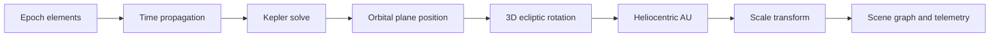

### Fidelity Contract

| Layer | What It Is Good For | Deliberate Limit |
| --- | --- | --- |
| Keplerian propagation | relative orbital geometry, scale reasoning, educational motion | no full N-body perturbation, relativistic correction, or navigation-grade state vectors |
| Comets and spacecraft | mission context and trajectory storytelling | approximate paths, not operational ephemerides |
| Visual scale modes | distance/diameter tradeoff demonstrations | hybrid mode intentionally compresses distance and magnifies bodies |
| Photographic textures | recognizable planetary surfaces and high-quality presentation | illustrative lighting, not a remote-sensing calibration pipeline |
| Observation panels | light-time, elongation, phase, RA/Dec, magnitude intuition | apparent magnitude and phase functions are simplified |

For mission operations, occultation prediction, telescope scheduling, or formal astrometry, use authoritative numerical ephemerides such as JPL Horizons.

---

## Architecture

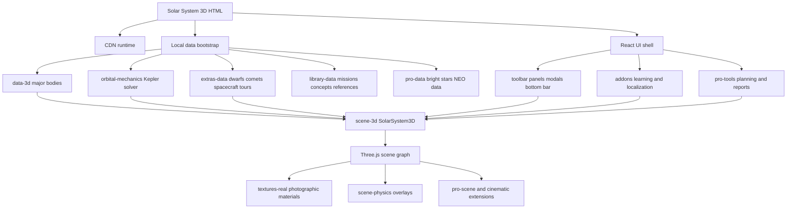

### Rendering Pipeline

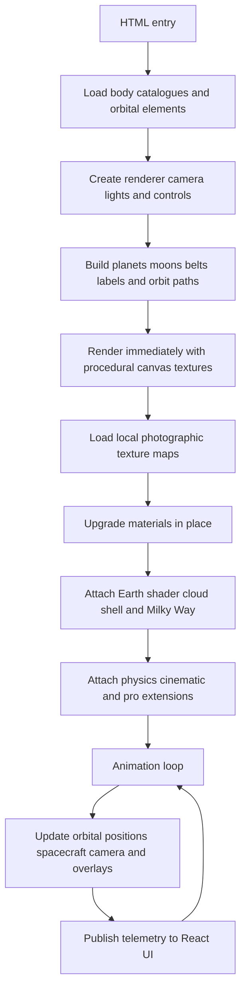

This section intentionally uses Mermaid `graph TD` syntax instead of a sequence-style diagram so older GitHub-style and VS Code Markdown Mermaid renderers do not fail with parser errors.

### Body Lookup Strategy

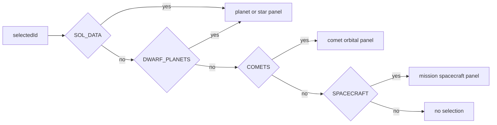

This lookup chain is used by the right panel, command palette, minimap, measurement HUD, compare modal, report generator, and export helpers.

---

## Scale System

| Mode | What It Preserves | What It Sacrifices | Intended Use |
| --- | --- | --- | --- |
| Hybrid | recognisable overview and navigability | true linear distances | default exploration and teaching |
| Real Distance | orbit spacing | body visibility | understanding emptiness and outer-system scale |
| Real Size | body diameter ratios | orbit spacing | comparing planet/star sizes |
| True 1:1 | size and distance simultaneously | visual discoverability | honest scale demonstration with locator dots |

The planet magnification slider is intentionally visible. When bodies are enlarged beyond true relative size, the interface labels the current display model rather than hiding the compromise.

---

## Interface Surfaces

| Surface | Role |
| --- | --- |
| Toolbar | mode tabs, search, command palette, library, measure, compare, photo, share, tours |
| Left panel | scale explanation, display toggles, science layers, physics overlays, body list, field notes |
| Middle workspace | WebGL canvas, telemetry, minimap, labels, measurement HUD, event banner, tour narration |
| Right panel | selected-body profile, physical data, orbital data, observations, moons, facts, physics formulas |
| Bottom bar | play/pause, speed presets, date picker, live-now mode, camera distance, current scale mode |
| Library modal | bodies, missions, concepts, glossary, timeline, source references |
| Command palette | keyboard-first navigation, layer toggles, time controls, saved views, data export |
| Compare modal | multi-body bars, radar option, and metric table |
| Add-on dock | language, events, scale comparison, surface explorer, quiz, deep-space/sound layers |
| Pro dock | grand tour, sky planner, NEO watch, observation report, bright stars, probe trails |

### Controls

| Input | Action |
| --- | --- |
| Left drag | rotate around target |
| Right drag / middle drag | pan camera |
| Shift + left drag | pan fallback for trackpads |
| Mouse wheel | zoom |
| Click body | select and follow body |
| `W` `A` `S` `D` | free-flight movement |
| `Q` / `E` | down / up movement |
| `Shift` | boost free-flight speed |
| Arrow keys | alternate movement |
| `Ctrl+K` / `Cmd+K` | command palette |
| `/` | command palette shortcut |
| `1`-`8` | jump to Mercury through Neptune |
| `9` | jump to Sun |
| `0` | jump to Pluto |
| `Esc` | close overlays, exit photo/measure/tour modes |

---

## Data Model

| File | Owns | Notes |
| --- | --- | --- |
| `data-3d.js` | Sun, planets, Pluto-style core catalogue, moons, physical facts | exposes `window.SOL_DATA`, texture generators, formatters |
| `orbital-mechanics.js` | J2000 secular elements and propagation functions | provides heliocentric AU positions and orbit samples |
| `extras-data.js` | dwarf planets, comets, spacecraft, events, tours | exposes `window.DWARF_PLANETS`, `window.COMETS`, `window.SPACECRAFT`, `window.TOURS` |
| `library-data.js` | missions, concepts, glossary, timeline, references | feeds the in-app research library |
| `physics.js` | formula output and computed physics cards | gravity, escape velocity, flux, Hill sphere, Roche-style values |
| `textures-real.js` | texture manifest and material upgrade pipeline | exposes `window.REAL_TEX` and upgrades scene materials |
| `pro-data.js` | bright-star catalogue, NEO examples, professional tour script | used by pro scene and pro tools |
| `scene-3d.js` | renderer, scene graph, camera controls, selection, scale system | owns `SolarSystem3D` and the render loop |
| `scene-physics.js` | visual theory overlays | attaches selected-body physics geometry |
| `addons.jsx` | localization, time machine, scale comparison, quiz, surface explorer, sound, gyro | mounted in its own React root |
| `pro-tools.jsx` | Sky Tonight, NEO Watch, report generator, grand tour dock | mounted in its own React root |

---

## Project Map

```text
./
  index.html                 # static-host entry, forwards to the app page
  Solar System 3D.html       # HTML app, CSS, root React app, toolbar/panels/modals
  data-3d.js                 # major body catalogue + procedural texture generators
  orbital-mechanics.js       # planetary and comet propagation helpers
  extras-data.js             # dwarf planets, comets, spacecraft, events, tours
  pro-data.js                # pro-mode data: bright stars, NEO list, cinematic script
  library-data.js            # reference library: missions, concepts, glossary, links
  scene-3d.js                # core Three.js renderer and scene graph
  textures-real.js           # real texture upgrade layer + Earth shader + Milky Way
  physics.js                 # formulas and per-body physics cards
  scene-physics.js           # visual physics overlays attached to the 3D scene
  premium.js                 # visual polish helpers
  pro-scene.js               # bright-star layer and spacecraft trail layer
  cinematic.js               # cinematic camera and presentation behavior
  icons.js                   # shared monoline icon path registry
  addons.jsx                 # extra React features and learning surfaces
  tweaks-panel.jsx           # runtime settings and adjustment panel
  premium-tweaks.jsx         # theme and premium UI controls
  pro-tools.jsx              # planner, report, NEO, and tour tools
  screenshots/               # README gallery captures generated from the live app
  textures/                  # local maps used by the real texture layer
```

---

## Deep Links And Sharing

Solar 3D stores key view state in the URL hash so a view can be copied and restored.

```text
#m=hybrid&b=earth&x=5
```

| Hash Key | Meaning | Example |
| --- | --- | --- |
| `m` | scale mode | `hybrid`, `real_distance`, `real_size`, `true_scale` |
| `b` | selected body id | `earth`, `jupiter`, `halley`, `voyager1` |
| `x` | planet magnification | `5`, `12.5` |
| `d` | date, when provided by share helpers | `2026-06-05` |

The Share menu can copy a restorable link or export a postcard PNG. Photo mode hides interface chrome for clean scene capture, and the command palette can export selected-body JSON data.

---

## Runtime State

Solar 3D uses `localStorage` for lightweight browser persistence. Clearing site data resets these preferences.

| Key | Purpose |
| --- | --- |
| `solar_seen_intro` | first-run onboarding dismissal |
| `solar_cmdk_recents` | command palette recent destinations |
| `solar_saved_views` | saved camera/body/mode/date views |
| `solar_quiz` | add-on quiz progress and statistics |
| `solar_lang` | add-on language setting (`en` / `tr`) |
| `solar_vol` | ambient sound volume |
| `tweaks:premium-tweaks` | theme and visual tweak state |

No account, backend, cookie banner, database, or external persistence layer is used.

---

## Development Workflows

### Add A Planet Or Core Body

1. Add a `SOL_DATA` entry in `data-3d.js` with physical properties, display color, facts, and notable moons.
2. Add or extend orbital elements in `orbital-mechanics.js` if the body needs propagated positions.
3. Add texture metadata in `textures-real.js` only if a local real map exists.
4. Add body-specific reference links in `library-data.js` when authoritative sources are available.
5. Test selection, right-panel data, minimap visibility, command palette lookup, compare modal, report generator, and share hash behavior.

### Add A Dwarf Planet, Comet, Or Spacecraft

1. Use `extras-data.js` rather than `data-3d.js`.
2. Dwarf planets should mirror the `SOL_DATA` shape where possible.
3. Comets use orbital elements with perihelion epoch and eccentricity.
4. Spacecraft can use fixed reference position plus AU/day velocity, a body-following offset, or Keplerian elements.
5. Confirm the object appears in scene creation, right-panel lookup, command palette, measurement mode, and library/report surfaces if applicable.

### Add A Guided Tour

Add a new object to `window.TOURS` in `extras-data.js`:

```js
{
  id: 'example-tour',
  name: 'Example Tour',
  description: 'Short description shown in the tours popover.',
  steps: [
    { bodyId: 'earth', narration: 'Narration shown while the camera flies to Earth.' },
    { bodyId: 'mars', narration: 'Narration shown while the camera flies to Mars.' },
  ],
}
```

### Add A Texture

1. Place the image in `textures/`.
2. Register it in `REAL_TEX` inside `textures-real.js`.
3. Use `map`, `bump`, `spec`, `night`, or `clouds` depending on material needs.
4. Run the dependency audit below so missing file references fail early.

### Add A README Screenshot

1. Start the local server from the repository root.
2. Open the exact UI state in the browser.
3. Capture either the full viewport for scene states or the modal element itself for tool panels.
4. Save the PNG under `screenshots/` with a descriptive lowercase name.
5. Prefer crops that show the feature boundary directly; avoid large black margins or unrelated chrome.

---

## Dependency Audit

Run this from the workspace root to verify that every local script referenced by the HTML entry point and every texture referenced by `textures-real.js` exists on disk:

```powershell
$root = "."
$html = Get-Content (Join-Path $root "Solar System 3D.html") -Raw
$scriptRefs = [regex]::Matches($html, '<script[^>]+src="([^"]+)"') |
  ForEach-Object { $_.Groups[1].Value } |
  Where-Object { $_ -notmatch '^https?://' } |
  ForEach-Object { ($_ -split '\?')[0] }
$textureRefs = [regex]::Matches((Get-Content "$root\textures-real.js" -Raw), "'([^']+\.(?:jpg|png|gif))'") |
  ForEach-Object { 'textures\' + $_.Groups[1].Value }
$missing = @($scriptRefs + $textureRefs | Where-Object { -not (Test-Path (Join-Path $root $_)) })
if ($missing.Count) { 'MISSING:'; $missing } else { "OK: $($scriptRefs.Count) local scripts and $($textureRefs.Count) texture references exist." }
```

Expected result for the current project:

```text
OK: 17 local scripts and 21 texture references exist.
```

---

## Troubleshooting

| Symptom | Likely Cause | Fix |
| --- | --- | --- |
| Directory listing opens instead of the app | server started from the wrong folder | run from the repository root or use `--directory .` |
| Blank page or only splash visible | CDN script did not load or WebGL is blocked | check internet access for CDN dependencies and confirm WebGL is enabled |
| Textures are missing | stale server root or missing local assets | start the server from the repository root and run the dependency audit |
| Port 5173 is busy | another local server is already running | use another port, for example `python -m http.server 8010 --bind 127.0.0.1 --directory .` |
| Hash opens an old body or mode | stale shared URL state | remove the hash after `.html` or use Reset in the toolbar |
| Movement feels too fast or too slow | free-flight speed scales with distance | move closer/farther, reset camera, or use target follow mode |
| Browser warns about Babel | JSX is compiled in-browser by design | acceptable for static/local runtime; precompile only for production packaging |
| Some values look approximate | simplified secular/orbital models | use NASA/JPL Horizons for mission-grade work |
| Modal controls appear behind a dock | stale browser cache after UI-layer updates | hard refresh the page so the current script query versions load |

---

## Performance Notes

Solar 3D is static, but the scene is GPU-heavy. It contains textured spheres, orbit paths, labels, star particles, asteroid and Kuiper belt particles, transparent overlays, physics helpers, and several React panels updating from live simulation state.

| Component | Recommendation |
| --- | --- |
| Browser | Current Chrome, Edge, Firefox, or Safari with WebGL enabled |
| GPU | Integrated GPU works; discrete GPU improves high-DPI and large displays |
| Display | 1080p or higher recommended for telemetry-heavy layouts |
| Server | Local HTTP server for stable image loading |

Performance-sensitive toggles:

| Toggle | Impact |
| --- | --- |
| Starfield / Milky Way / bright stars | large sky sphere or point catalogue |
| Labels | per-frame screen-space projection |
| Comets + tails | extra orbit paths and sprite updates |
| Spacecraft trails | periodically reprojected polylines |
| Physics overlays | extra geometry around the selected body |
| Surface explorer | second Three.js renderer inside a modal |
| Photo/postcard export | canvas readback and PNG encode |

---

## Source Credibility

The reference layer is curated from public NASA, ESA, JPL, IAU, and educational astronomy sources. The simulation itself is an educational visualization, not a navigation product.

| Domain | Source Class |
| --- | --- |
| physical constants | NASA planetary fact sheets and public mission references |
| orbital mechanics | JPL approximate planetary position conventions and Keplerian element propagation |
| missions | NASA / ESA / JAXA public mission portals |
| concepts | astronomy textbooks, IAU definitions, NASA educational material |
| imagery | local planetary texture maps derived from public-domain / openly mirrored planetary texture sets |

Scientific humility clause: values are intended for high-quality education and visual reasoning. For spacecraft operations, occultation predictions, or observatory scheduling, use authoritative ephemeris services such as JPL Horizons.

---

## Production Packaging Ideas

The current project is optimized for direct local execution. If it later needs to ship as a public production site, these are the natural next steps:

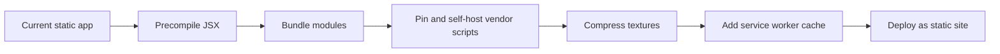

| Area | Upgrade |
| --- | --- |
| Build | Vite or esbuild for precompiled React/JSX |
| Assets | WebP/AVIF texture variants and cache headers |
| Reliability | self-host React, Babel replacement, Three.js, OrbitControls |
| QA | Playwright smoke tests for canvas render and key UI actions |
| Accessibility | formal keyboard focus pass for all toolbar/menu controls |
| Documentation | regenerate screenshots after major visual changes |

---

## Verification Checklist

Before considering a change complete:

```text
[ ] Start local server from the repository root
[ ] Open /
[ ] Confirm canvas renders and toolbar is interactive
[ ] Select Sun, Earth, Jupiter, Pluto, a comet, and a spacecraft
[ ] Toggle scale modes and magnification
[ ] Toggle science layers, physics overlays, bright stars, and probe trails
[ ] Open Library, Measure, Compare, Share, Tours, Command palette, and Add-on tools
[ ] Open Sky Tonight, NEO Watch, and Observation Report from the Pro dock
[ ] Run dependency audit
[ ] Check browser console for 404s or runtime exceptions
[ ] Refresh README screenshots after visual UI changes
```

---

## License

Released under the MIT License. See [LICENSE](LICENSE) for the full license text.

---

<div align="center">

<sub>
Built as a browser-native observatory: local scientific data, GPU-rendered space, transparent approximations, and enough controls to move from visual curiosity to quantitative reasoning without leaving the page.
</sub>

</div>
